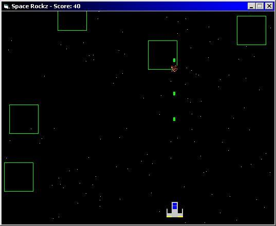



## Space Rockz \- Asteriods game

### Description

This is really fast for a non-DirectX game, too! I like this, it's smooth, fun, and best of all, addictive... It's got explotions, double-getkeys(e.g you can press left and up and you'll go diagnal), and even a randomly generated space galixy background! Try it out for youself, and plz plz plz vote!
 
### More Info
 

             |
---                |---
**Submitted On**   |2002-04-04 23:53:36
**By**             |[SOLID4K TEAM](https://github.com/Planet-Source-Code/PSCIndex/blob/master/ByAuthor/solid4k-team.md)
**Level**          |Intermediate
**User Rating**    |4.0 (20 globes from 5 users)
**Compatibility**  |VB 5\.0, VB 6\.0
**Category**       |[Games](https://github.com/Planet-Source-Code/PSCIndex/blob/master/ByCategory/games__1-38.md)
**World**          |[Visual Basic](https://github.com/Planet-Source-Code/PSCIndex/blob/master/ByWorld/visual-basic.md)
**Archive File**   |[Space\_Rock68936452002\.zip](https://github.com/Planet-Source-Code/solid4k-team-space-rockz-asteriods-game__1-33454/archive/master.zip)

